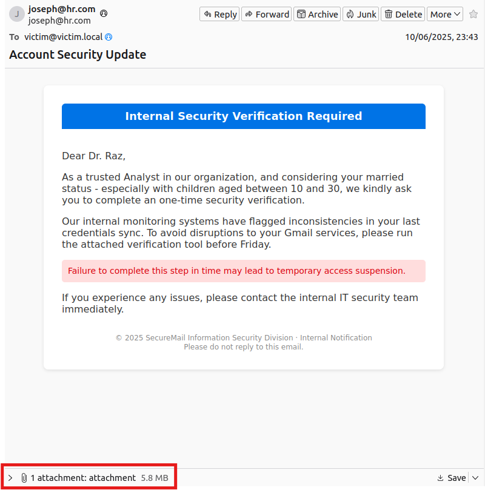
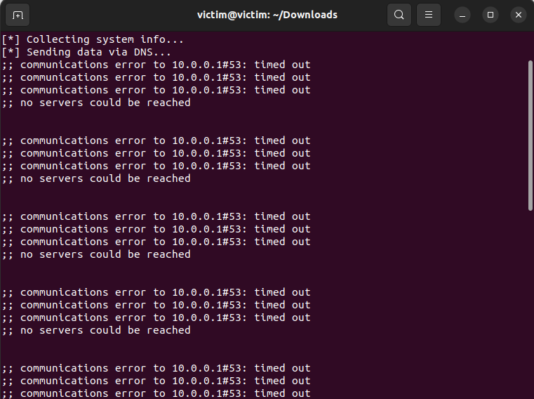

# Phishing Email Simulation - Educational Cybersecurity Project

> **Disclaimer:** This project is for educational and research purposes **only**.  
> Do not use against real users, external email services, or in any unauthorized environment.

## Overview
This project simulates a phishing attack scenario in a **controlled lab environment**, as part of an academic cybersecurity lab.  
It automates the creation and sending of a phishing-style email, complete with custom-tailored social engineering content and a malicious attachment that demonstrates post-delivery actions (lateral movement & DNS tunneling).

The simulation is designed to run entirely in a safe, isolated setup (e.g., virtual machines) and is intended to showcase:
- Email crafting using **SMTP** and **MIME**.
- Payload generation and attachment embedding.
- Simulated malware execution logic.
- Covert data exfiltration using **DNS tunneling**.

---

## Features

1. **Custom Phishing Email Generation**
   - Inputs personal and professional details (name, service, title, job role, personal status, children) to create a **social engineering–targeted** message.

2. **Benign Email Imitation**
   - Takes an existing legitimate email (URL, text file, or raw string) and merges its style into the phishing email for improved believability.

3. **Malicious Attachment Creation**
   - Generates an executable (`.exe` or `.py`) that simulates post-exploitation activity.
   - **Currently works on Linux only**. Future updates will add full Windows support.

4. **Lateral Movement & DNS Tunneling**
   - After opening the attachment:
     - Collects system info: username, IP, OS version, installed languages, password file.
     - Sends the data covertly to a local DNS server (BIND9).
     - Hardcoded server IP configurable in `.env`.

5. **Safe Testing Environment**
   - Designed for VM-to-VM simulation.
   - Tested with **Postfix** as the SMTP server.

---

## Architecture / Workflow

```text
[ Attacker VM ]
   |
   |--(1) Run Phishing.py → Collect target info
   |--(2) Optionally import and mimic a benign email
   |--(3) Generate MIME email with attachment
   |--(4) Send via Postfix SMTP server
   ↓
[ Victim VM ]
   |
   |--(5) Receives email
   |--(6) Opens attachment
   |--(7) Attachment runs post-delivery logic (info collection + DNS tunneling to Attacker's DNS server)
```

---

## Installation

**Clone the repository**
```bash
git clone https://github.com/Raz99/Phishing-Email.git
cd Phishing-Email
```

**Install dependencies**
```bash
pip install -r requirements.txt
```

**Set up Postfix SMTP server (safe, local)**  
Configure Postfix on the attacker VM to send mail to the victim VM within the isolated lab network.

**Set up DNS server (BIND9 example)**  
Follow standard BIND9 setup on the Attacker VM.

---

## Usage

### Generate phishing email
```bash
python Phishing.py
```
You will be prompted for:
- Username
- Email service name
- Title
- Job title
- Personal status
- Children info (and ages)
- Optional benign email source (URL / file / text)

### Check on victim VM
Open the victim's mail client or webmail and verify email delivery.

---

## Screenshots (from Victim's machine)

1. **Phishing email preview in victim inbox**  
<p align="center">
  
</p>

2. **Attachment execution + DNS tunneling logs (running in background)**
<p align="center">
  
</p>

---

## Project Structure

```
Phishing-Email/
│
├── Phishing.py              # Main script - builds and sends phishing email
├── attach_create.py         # Converts payload script into executable
├── attachment_payload.py    # Simulated post-delivery malicious actions
├── requirements.txt
├── README.md
└── assets/
    └── screenshots/         # Screenshots from Attacker & Victim's virtual machines
```

---

## License
MIT License © 2025 Raz Cohen  
